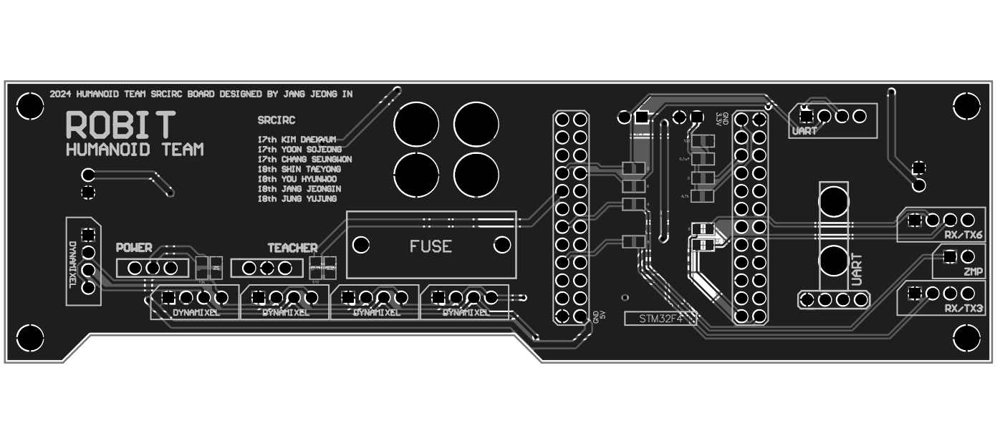

<html lang="en">
  <head>
    <meta charset="uft-8">
    <meta name="author" content="Jeongin Jang">
  </head>
  <body>
    <h1>SRCIRC24 MainBoard</h1>
    <h2>About Main Board</h2>
    

       The Main Board is a single board for driving the robot designed to be mounted on CHULSU-OP4 of RO:BIT Humanoid Team.
       
       
      <!--
      -->
      <table>
        <tr>
          <td>
            <a href="image/SRCIRC24_MainBoard.png">
              

                
              

            </a>
          </td>
          <td>
            <a href="image/SRCIRC24_MainBoard.png">
              

                
            

          </td>
          <td>
            <a href="image/SRCIRC24_MainBoard.png">
              

                
            

          </td>
        </tr>
        <tr>
          <td>
            

              PCB preview image
            

          </td>
          <td>
            

              After mounting electronic components
            

          </td>
          <td>
            

              After attaching module board
            

          </td>     
        </tr>
      </table>
    

    <h2>Repository Contents</h2>
    

    <dl>
      <dt>\image</dt>
      <dd>PCB preview images and capture of design screen</dd>
      <dt>\libraries</dt>
      <dd>Libraries used in Altium designer</dd>
      <dt>\Schematic</dt>
      <dd>Circuit diagram of this product</dd>
      <dt>.sch</dt>
      <dd>Schematic design file by Autodesk Eagle</dd>
    </dl>
    

    <h2>Documentation</h2>
      

        <h3>Materials</h3>
        The below shows the components actually mounted on the CHULSU-OP4 equipped MainBoard in SRCIRC2024. Their details are listed below.
          <table>
            <thead>
              <tr>
                <th> Eagle Design Parts # </th>
                <th> Q'ty </th>
                <th> Mfr. Product # </th>
                <th> Supplier </th>
                <th> Description </th>
              </tr>
            </thead>
            <tbody>
              <tr>
                <td>R1, R2, R3, R4, R5, R6, R7, R8, R9, R10, R11, R13, R14, R15, R16, R17</td>
                <td>17</td>
                <td>SMD_Resistor</td>
                <td><a href="https://www.devicemart.co.kr/goods/view?no=6061">DEVICEMART</a></td>
                <td>Multilayer Ceramic Capacitors SMD/SMT 0.1uF 50V 10% 0603</td>
              </tr>
<!--               <tr>
                <td>C11,C15</td>
                <td>2</td>
                <td>UWT1E221MNL1GS</td>
                <td><a href="https://akizukidenshi.com/catalog/g/gP-10420/">Akizuki</a></td>
                <td>ChipResistor SMD F 1KΩ</td>
              </tr> -->
              <tr>
                <td>C1,C2</td>
                <td>2</td>
                <td>MC0603B104K500CT</td>
                <td><a href="https://www.devicemart.co.kr/goods/view?no=12031936">DEVICEMART</a></td>
                <td> CAPACITOR CERAMIC, 0.1UF, 50V, X7R, 10%</td>
              </tr>
              <tr>
                <td>C13</td>
                <td>1</td>
                <td>GRM21BR61E226ME44</td>
                <td><a href="https://akizukidenshi.com/catalog/g/gP-08240/">Akizuki</a></td>
                <td>Multilayer Ceramic Capacitors SMD/SMT 22uF 25V 15% 0603</td>
              </tr>
              <tr>
                <td>C16</td>
                <td>1</td>
                <td>GRM188R6YA106MA73</td>
                <td><a href="https://akizukidenshi.com/catalog/g/gP-13161/">Akizuki</a></td>
                <td>Multilayer Ceramic Capacitors SMD/SMT 10uF 35V 20% 0603</td>
              </tr>
              <tr>
                <td>C7, C8, C9, C10</td>
                <td>4</td>
                <td>35PFV150M8X10.5</td>
                <td><a href="https://akizukidenshi.com/catalog/g/gP-14492/">Akizuki</a></td>
                <td>Aluminum Organic Polymer Capacitors SMD/SMT 150uF 35V 20% AEC-Q200</td>
              </tr>
              <tr>
                <td>CH1, CH2</td>
                <td>2</td>
                <td>XT60PW-M</td>
                <td><a href="https://store.shopping.yahoo.co.jp/suzakulab/amass-xt60pw-m.html">Suzaku Lab.</a></td>
                <td>DC Power Connector, Through Hole, Horizontal, Male, 30A 500V</td>
              </tr>
              <tr>
                <td>CH3</td>
                <td>1</td>
                <td>B2B-XH-A-BLACK</td>
                <td><a href="https://www.daisen-netstore.com/shopdetail/000000000029/ct15/page1/order/">DAISEN</a></td>
                <td>Connector Header Through Hole, Top entry 2 position 2.54mm BLACK</td>
              </tr>
              <tr>
                <td>CH4</td>
                <td>1</td>
                <td>B2B-XH-A-BLUE</td>
                <td><a href="https://www.daisen-netstore.com/shopdetail/000000000029/ct15/page1/order/">DAISEN</a></td>
                <td>Connector Header Through Hole, Top entry 2 position 2.54mm BLUE</td>
              </tr>
              <tr>
                <td>CH5</td>
                <td>1</td>
                <td>B2B-XH-A-GREEN</td>
                <td><a href="https://www.daisen-netstore.com/shopdetail/000000000029/ct15/page1/order/">DAISEN</a></td>
                <td>Connector Header Through Hole, Top entry 2 position 2.54mm GREEN</td>
              </tr>
              <tr>
                <td>CH6</td>
                <td>1</td>
                <td>B2B-XH-A-YELLOW</td>
                <td><a href="https://www.daisen-netstore.com/shopdetail/000000000029/ct15/page1/order/">DAISEN</a></td>
                <td>Connector Header Through Hole, Top entry 2 position 2.54mm YELLOW</td>
              </tr>
              <tr>
                <td>CH7</td>
                <td>1</td>
                <td>B2B-XH-A-RED</td>
                <td><a href="https://www.daisen-netstore.com/shopdetail/000000000029/ct15/page1/order/">DAISEN</a></td>
                <td>Connector Header Through Hole, Top entry 2 position 2.54mm RED</td>
              </tr>
              <tr>
                <td>CH8, CH9</td>
                <td>2</td>
                <td>S4B-XH-A(LF)(SN)-YELLOW</td>
                <td><a href="https://www.daisen-netstore.com/shopdetail/000000000028/ct15/page1/order/">DAISEN</a></td>
                <td>Connector Header Through Hole, Side entry 4 position 2.54mm YELLOW</td>
              </tr>
              <tr>
                <td>CH10</td>
                <td>1</td>
                <td>S4B-XH-A(LF)(SN)-GREEN</td>
                <td><a href="https://www.daisen-netstore.com/shopdetail/000000000028/ct15/page1/order/">DAISEN</a></td>
                <td>Connector Header Through Hole, Side entry 4 position 2.54mm GREEN</td>
              </tr>
              <tr>
                <td>CH11, CH12</td>
                <td>2</td>
                <td>S4B-XH-A(LF)(SN)-BLUE</td>
                <td><a href="https://www.daisen-netstore.com/shopdetail/000000000028/ct15/page1/order/">DAISEN</a></td>
                <td>Connector Header Through Hole, Side entry 4 position 2.54mm BLUE</td>
              </tr>
              <tr>
                <td>CH13</td>
                <td>1</td>
                <td>S4B-XH-A(LF)(SN)-RED</td>
                <td><a href="https://www.daisen-netstore.com/shopdetail/000000000028/ct15/page1/order/">DAISEN</a></td>
                <td>Connector Header Through Hole, Side entry 4 position 2.54mm RED</td>
              </tr>
              <tr>
                <td>D1</td>
                <td>1</td>
                <td>SS34FA</td>
                <td><a href="https://www.mouser.jp/ProductDetail/512-SS34FA">Mouser</a></a></td>
                <td>Schottky Barrier Rectifiers SMD/SMT 3 A 40 V</td>
              </tr>
              <tr>
                <td>F1, F2, F4</td>
                <td>3</td>
                <td>0891020.NXS</td>
                <td><a href="https://www.mouser.jp/ProductDetail/576-0891020.NXS">Mouser</a></td>
                <td>Automotive Fuses LP MINI 58V 20A</td>
              </tr>
              <tr>
                <td>F1, F2, F4, F6</td>
                <td>4</td>
                <td>3557-2</td>
                <td><a href="https://www.mouser.jp/ProductDetail/534-3557-2">Mouser</a></td>
                <td>Fuse Holder Through Hole 500V 30A</td>
              </tr>
              <tr>
                <td>F3</td>
                <td>1</td>
                <td>MF-MSMF010</td>
                <td><a href="https://akizukidenshi.com/catalog/g/gP-15428/">Akizuki</a></td>
                <td>PTC Resettable Fuses SMD/SMT 0.1A 60V 1812</td>
              </tr>
              <tr>
                <td>F5</td>
                <td>1</td>
                <td>MF-MSMF050/30X-2</td>
                <td><a href="https://www.mouser.jp/ProductDetail/652-MF-MSMF050/30X-2">Mouser</a></td>
                <td>PTC Resettable Fuses SMD/SMT 0.5A 30V 1812</td>
              </tr>
              <tr>
                <td>F6</td>
                <td>1</td>
                <td>MO-29</td>
                <td><a href="https://www.amazon.co.jp/dp/B0722VT9DQ/">Amazon</a></td>
                <td>Automotive Fuses LP MINI 7.5A</td>
              </tr>
              <tr>
                <td>IC1, IC2, IC3, IC4</td>
                <td>4</td>
                <td>ADM3078EARZ</td>
                <td><a href="https://www.mouser.jp/ProductDetail/584-ADM3078EARZ">Mouser</a></td>
                <td>3.3 V, ±15 kV ESD-Protected, Half- and Full-Duplex, RS-485/RS-422 Transceivers</td>
              </tr>
              <tr>
                <td>IC5</td>
                <td>1</td>
                <td>LTC4412ES6</td>
                <td><a href="https://akizukidenshi.com/catalog/g/gI-07305/">Akizuki</a></td>
                <td>PMIC Low Loss PowerPath Controller</td>
              </tr>
              <tr>
                <td>L1,L2</td>
                <td>2</td>
                <td>CDRH127/LDNP-470MC</td>
                <td><a href="https://akizukidenshi.com/catalog/g/gP-13966/">Akizuki</a></td>
                <td>Power Inductors - SMD 47uH 3.25A</td>
              </tr>
              <tr>
                <td>L3</td>
                <td>1</td>
                <td>DFE201210S-2R2M</td>
                <td><a href="https://akizukidenshi.com/catalog/g/gP-14976/">Akizuki</a></td>
                <td>Power Inductors - SMD 2.2 uH 1.5A</td>
              </tr>
              <tr>
                <td>LED1,LED2,LED3,LED4</td>
                <td>4</td>
                <td>150060VS86000</td>
                <td><a href="https://www.mouser.jp/ProductDetail/710-150060VS86000">Mouser</a></td>
                <td>Standard LEDs - SMD Green 2V 20mA 573nm 0603</td>
              </tr>
              <tr>
                <td>LED5,LED6</td>
                <td>2</td>
                <td>150060YS75000</td>
                <td><a href="https://www.mouser.jp/ProductDetail/710-150060YS75000">Mouser</a></td>
                <td>Standard LEDs - SMD Yellow 2V 20mA 590nm 0603</td>
              </tr>
              <tr>
                <td>M1</td>
                <td>1</td>
                <td>FT4232H MINI MODULE</td>
                <td><a href="https://www.mouser.jp/ProductDetail/895-FT4232HMINIMOD">Mouser</a></td>
                <td>Interface Development Tools USB Hi-Speed FT4323H Evaluation Module</td>
              </tr>
              <tr>
                <td>M1</td>
                <td>2</td>
                <td>FH-2x13SG</td>
                <td><a href="https://akizukidenshi.com/catalog/g/gC-00084/">Akizuki</a></td>
                <td>2.54mm Pin Socket, 2 Row, 26 Pin</td>
              </tr>
              <tr>
                <td>Q1, Q2, Q3, Q4, Q5</td>
                <td>5</td>
                <td>SQM40P10-40L_GE3</td>
                <td><a href="https://www.mouser.jp/ProductDetail/78-SQM40P10-40L_GE3">Mouser</a></td>
                <td>Pch MOSFET 100V 40A 150W 33mohm</td>
              </tr>
              <tr>
                <td>R1, R3, R4, R6, R7, R9, R10, R12</td>
                <td>8</td>
                <td>RC0603FR-10680RL</td>
                <td><a href="https://www.mouser.jp/ProductDetail/603-RC0603FR-10680RL">Mouser</a></td>
                <td>Thick Film Resistors - SMD 680 Ohms 100-200mW 1% 0603</td>
              </tr>
              <tr>
                <td>R13, R14, R22</td>
                <td>3</td>
                <td>RC0603FR-101KL</td>
                <td><a href="https://www.mouser.jp/ProductDetail/603-RC0603FR-101KL">Mouser</a></td>
                <td>Thick Film Resistors - SMD 1 kOhms 100-200mW 1% 0603</td>
              </tr>
              <tr>
                <td>R15, R16, R20, R23</td>
                <td>4</td>
                <td>RC0603FR-102KL</td>
                <td><a href="https://www.mouser.jp/ProductDetail/603-RC0603FR-102KL">Mouser</a></td>
                <td>Thick Film Resistors - SMD 2 kOhms 100-200mW 1% 0603</td>
              </tr>
              <tr>
                <td>R17</td>
                <td>1</td>
                <td>RC0603FR-10470KL</td>
                <td><a href="https://www.mouser.jp/ProductDetail/603-RC0603FR-10470KL">Mouser</a></td>
                <td>Thick Film Resistors - SMD 470 kOhms 100-200mW 1% 0603</td>
              </tr>
              <tr>
                <td>R21</td>
                <td>1</td>
                <td>RC0603FR-078K66L</td>
                <td><a href="https://www.mouser.jp/ProductDetail/603-RC0603FR-078K66L">Mouser</a></td>
                <td>Thick Film Resistors - SMD 8.66 kOhms 100-200mW 1% 0603</td>
              </tr>
              <tr>
                <td>R18, R19</td>
                <td>2</td>
                <td>RC0603FR-1010KL</td>
                <td><a href="https://www.mouser.jp/ProductDetail/603-RC0603FR-1010KL">Mouser</a></td>
                <td>Thick Film Resistors - SMD 10 kOhms 100-200mW 1% 0603</td>
              </tr>
              <tr>
                <td>R2, R5, R8, R11</td>
                <td>4</td>
                <td>RC0603FR-10120RL</td>
                <td><a href="https://www.mouser.jp/ProductDetail/603-RC0603FR-10120RL">Mouser</a></td>
                <td>Thick Film Resistors - SMD 120 Ohms 100-200mW 1% 0603</td>
              </tr>
              <tr>
                <td>VR1</td>
                <td>1</td>
                <td>XL6009E1</td>
                <td><a href="https://www.aitendo.com/product/10307">Aitendo</a></td>
                <td>400KHz 60V 4A Switching Current Boost / Buck-Boost / Inverting DC/DC Converter</td>
              </tr>
            </tbody>
